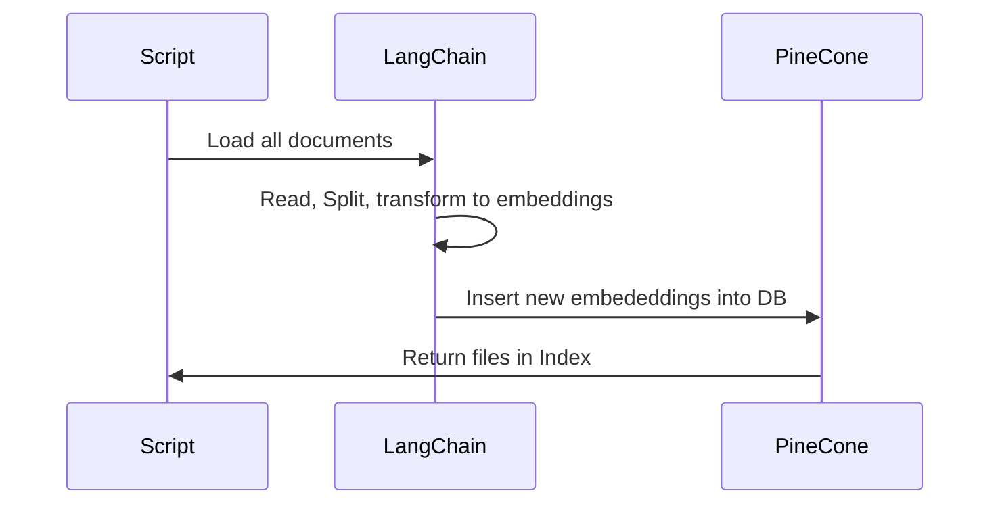
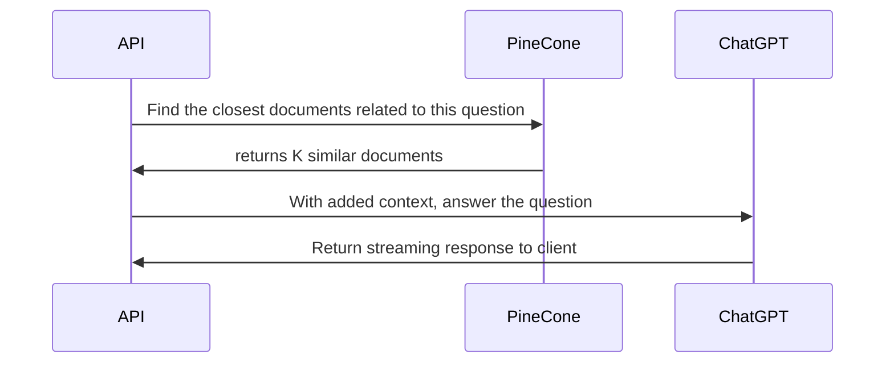

# Resume Chat

This application was created during my recent hiring experience. I have a separate repository where I use LangChain to load my resume and a question bank of interview questions which then get fed to a vector database (PineCone). For each request, we do a "similarity" search on the DB, then feed that as context to ChatGPT and answers the question.

This should be pretty close to what I would answer if I had a good vector database inside my head.

## Getting Started

First, run the development server:

```bash
npm run dev
# or
yarn dev
# or
pnpm dev
```

Open [http://localhost:3000](http://localhost:3000) with your browser to see the result.

You can start editing the page by modifying `app/page.tsx`. The page auto-updates as you edit the file.

This project uses [`next/font`](https://nextjs.org/docs/basic-features/font-optimization) to automatically optimize and load Inter, a custom Google Font.

## FAQ

#### How does it work?

There is 2 parts to this project

1. The loader
2. Chat API

The loader (configured in a separate repo) works the following way



Chat API


