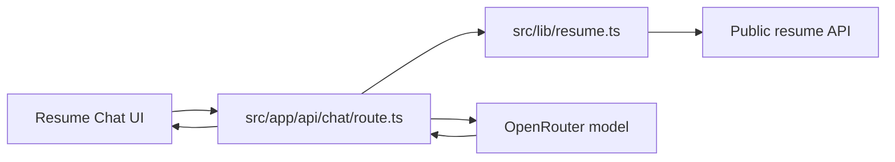

<p align="center">
  
</p>

# Resume Chat · Ask the resume, skip the PDF hunt

[](https://github.com/aranlucas/resume-chat/actions/workflows/ci.yml)
[](LICENSE)

Resume Chat turns Lucas Arango's public resume into a quick conversation. A
recruiter or collaborator can ask a plain-language question and watch an
OpenRouter answer stream back with the published resume in context—no vector
database or embedding pipeline required.

> **Try the useful question:** “What did Lucas build with Go?” Ask it, get a
> grounded answer, then open the source resume when the detail matters.

Try the deployed app at [hire-lucas.vercel.app](https://hire-lucas.vercel.app/).

The public resume service is the source of truth. This application is a
presentation and question-answering layer, so generated answers should be
checked against the source resume before they are used for a hiring decision.

## Setup

1. Create a dedicated API key at https://openrouter.ai/keys. The default
   `openrouter/free` router uses available free models; set a $0 credit limit
   on the key to prevent paid usage. Free models have provider rate limits.
2. Copy the env template and fill it in:

```bash
cp .env.template .env.local
```

3. Run locally:

```bash
pnpm install
pnpm dev
```

Open [http://localhost:3000](http://localhost:3000).

## Configuration

| Variable           | Required | Default                     | Description                                  |
| ------------------ | -------- | --------------------------- | -------------------------------------------- |
| `OPENROUTER_API_KEY` | Yes      | —                           | OpenRouter API key                           |
| `RESUME_API_URL`     | No       | `https://resume-api.aranlucas.workers.dev` | Resume API base URL, e.g. a local `_site` server |
| `OPENROUTER_MODEL`   | No       | `openrouter/free`           | Routes to available free models. Can be overridden with a current OpenRouter model id. See https://openrouter.ai/collections/free-models |

## Vercel deployment

The existing project is `aranlucas-projects/resume-chat`, served at
[hire-lucas.vercel.app](https://hire-lucas.vercel.app/).

1. Link this checkout: `vercel link --project resume-chat --scope aranlucas-projects`.
2. Set `OPENROUTER_API_KEY` as a server-only secret for Production, Preview,
   and Development in the project's environment settings. Set
   `OPENROUTER_MODEL` to `openrouter/free` for those environments.
3. Deploy with `vercel deploy --prod`. Environment changes require a new
   deployment to take effect.
4. Ask a question on the live site and confirm a complete answer streams.

For local development, pull the Development environment with
`vercel env pull .env.local`. Keep `.env.local` untracked. The current app
does not require OpenAI or Pinecone environment variables.

## Resume source

The resume lives in [aranlucas/resume](https://github.com/aranlucas/resume) as a
[JSON Resume](https://jsonresume.org/schema), published without private info to
[resume-api.aranlucas.workers.dev](https://resume-api.aranlucas.workers.dev/).
`src/lib/resume.ts` fetches `resume.md` (the assistant's system prompt) and
`resume.json` (the page's experience timeline) with a 30-day cache tagged
`resume`. The resume repo's deploy calls `POST /api/revalidate` to refresh both right away. To update
the resume, edit it there.

## Verify

```bash
pnpm format:check
pnpm lint
pnpm typecheck
pnpm test
pnpm build:test
```

`pnpm test` exercises request validation, cancellation, provider failures, and
Stop/New conversation flows with mocked models and synthetic resume data.
`pnpm build:test` (also used by CI) prerenders against a loopback fixture server
with the model key cleared. Its build output contains a fictional profile and
is only for verification; use `pnpm build` for a production build.

The public chat endpoint accepts text questions up to 4,000 characters, at most
40 messages and 48,000 total text/reasoning characters, and a 128 KiB JSON body.
Assistant history allows text, reasoning, and step markers, including partial
responses after Stop. Unsupported roles and attachments are rejected. Invalid
requests return a safe 400 before loading the resume or calling a model.
Resume loading has a 10-second deadline; generation has a 45-second deadline
and a 2,048-token output cap. Failures before streaming return a safe 503;
failures after streaming starts use the same message in the SDK error stream.
These per-request limits do not replace deployment-level rate limiting.

## How the request flows


```mermaid
flowchart LR
  Browser[Resume Chat UI] --> Route[src/app/api/chat/route.ts]
  Route --> Resume[src/lib/resume.ts]
  Resume --> API[Public resume API]
  Route --> OpenRouter[OpenRouter model]
  OpenRouter --> Route
  Route --> Browser
```

Resume text and JSON are cached for 30 days with the `resume` cache tag. The
resume repository can call `POST /api/revalidate` after publishing to refresh
the cached content. The chat route validates the incoming request and returns
an error when the server key is missing.

## Source map

- `src/app/page.tsx` and `src/app/profile-chat.tsx` compose the landing page.
- `src/components/conversation.tsx` and `message-response.tsx` render the
  streaming conversation.
- `src/app/api/chat/route.ts` supplies the production model and resume adapters.
- `src/lib/chat-answer.ts` owns the bounded request, cancellation, and error contract.
- `src/lib/resume.ts` fetches and validates the public resume documents.
- `src/app/api/revalidate/route.ts` accepts the cache refresh webhook.
- `.env.template` lists the supported runtime settings.

## Status and boundaries

This is a focused portfolio demo backed by a public resume endpoint. It has no
account system, private resume source, conversation database, or paid-model
requirement. Model availability, rate limits, and the freshness of the public
resume service can affect responses.
